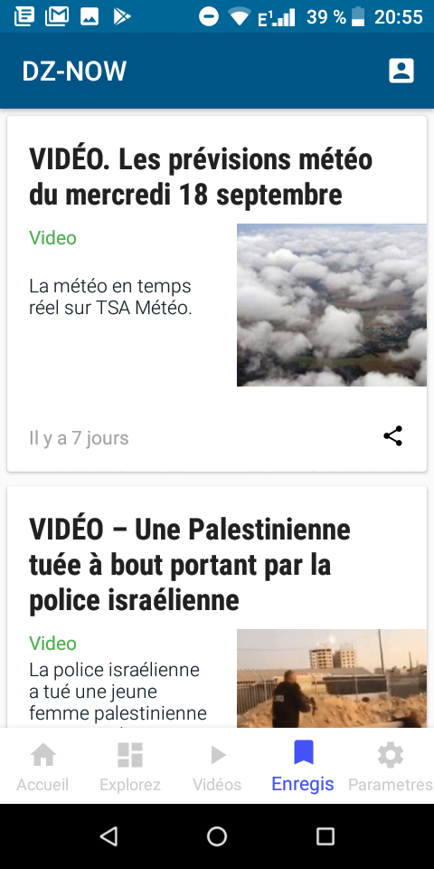

# DZ-Now
Une application qui regroupe les sites d'informations algeriens, elle permet d'afficher des articles de differentes sources.

- Affichage de tous les articles (recyclerview)
- Affichage d'un article (écran natif) 
- Affichage de l'article original (webview
- Ecran contenant uniquement les vidéos des articles (RecyclerView - ExoPlayer - YoutubeExtractor) 
- Enregistrement des articles en local (API Room)
- Authentification google
- Enregistrement des articles dans une base de données distante (Retrofit) 
- Utilisation d'une api

